# LaraCart

> [!NOTE]
> LaraCart is an e-commerce platform built as a part of my assessment at Trustfactory. Demo at : https://cart.momik.dev

## Base Requirements

This application implements the core requirements specified:

*   **Shopping Cart System**: A fully functional cart allowing users to add, update, and remove items. The cart is database-backed (persisted), ensuring users do not lose their items across sessions or devices.
*   **Product Browsing**: Users can browse products fetched from the DummyJSON API.
*   **Authentication**: Secure user registration and login functionality using Laravel Breeze.
*   **Low Stock Notifications**: The system monitors inventory levels. automated background jobs dispatch email alerts to administrators when stock falls below defined thresholds.
*   **Daily Sales Report**: A scheduled job compiles sales data (revenue, units sold, top categories) and emails a summary report to administrators daily.

## Additional Technical Implementation

Beyond the base requirements, the following advanced features and technical decisions were implemented:

1.  **Profile Toggling (Admin/Consumer Mode)** </br>
    The application features a "Persona Switcher" that allows a single user account to toggle between "Admin" and "Consumer" views. This facilitates easy testing of both role-specific interfaces without needing multiple accounts.

2.  **Queue Jobs & Asynchronous Processing** </br>
    Heavy operations are offloaded to background queues to ensure specific user interactions remain fast.
    -   `StockAlertMail`: Low stock alerts are queued.
    -   `ProcessOrderPayment`: Order processing is simulated asynchronously.
    -   `DailySalesReport`: Sales aggregation runs in the background.
    -   Queue Worker: `php artisan queue:work` must be running to process these jobs.

3.  **Custom Artisan Commands** </br>
    Custom commands encapsulate complex business logic:
    -   `products:fetch`: Seeds the database with data from the third-party API.
    -   `app:send-daily-report`: Manually triggers the daily sales report generation.
    -   `app:send-stock-alert`: Manually triggers stock alerts for testing purposes.

4.  **Model Observers** </br>
    A `ProductObserver` is attached to the `Product` model. It listens for changes to the `stock_quantity` attribute and automatically triggers the stock alert job when the threshold is breached, ensuring separation of concerns between controller logic and side effects.

5.  **Infinite Scroll (Marketplace)** </br>
    The product listing page (`resources/js/Pages/Products/Index.vue`) implements infinite scrolling using the `IntersectionObserver` API. This replaces standard pagination for a smoother user experience, dynamically loading more products as the user scrolls to the bottom of the list view.

6.  **Payment Processing Mock** </br>
    The checkout flow includes a realistic simulation of payment processing. It supports simulated "Card" and "PayPal" flows, handling loading states and asynchronous validation before confirming the order. I'm mocking this because I dont have a personal sandbox acc for Paypal nor can register for Stripe.

7.  **Dashboard Artisan Interface** </br>
    The Admin Dashboard includes a UI for running Artisan commands immediately (e.g., "Run Daily Report", "Sync Products", "Clear Cache"). This allows administrators to trigger system maintenance tasks without CLI access.

8.  **Deployment** </br>
    The application is deployed and accessible at:
    http://laracart.momikshrestha.com.np

## Screenshots

### Dashboard
<p float="left">
  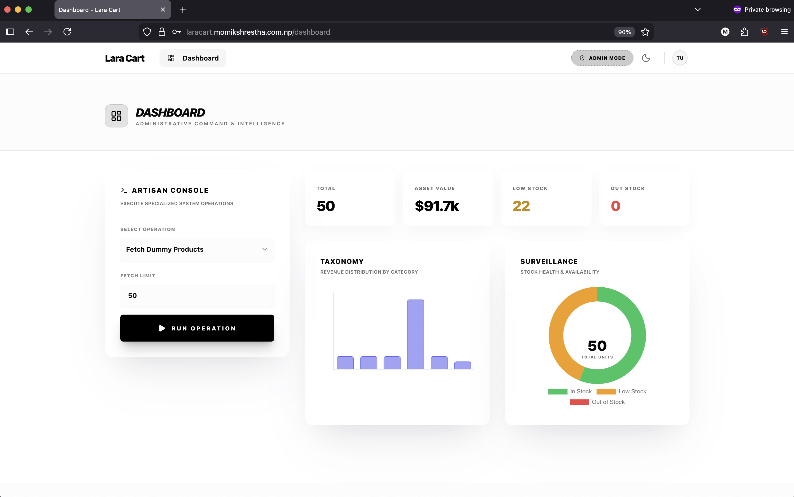
  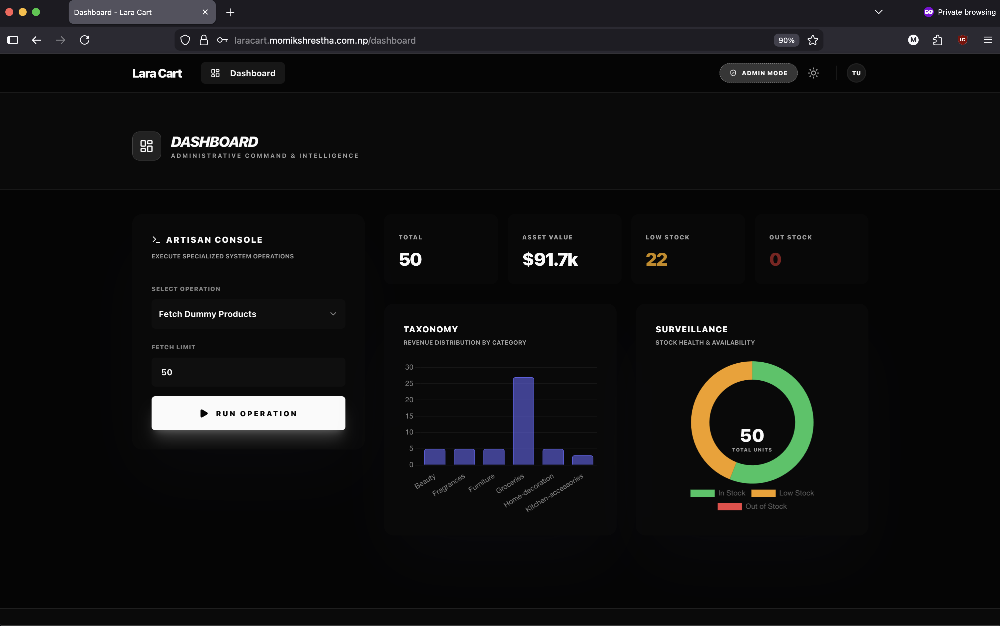
</p>

### Products Grid View
<p float="left">
  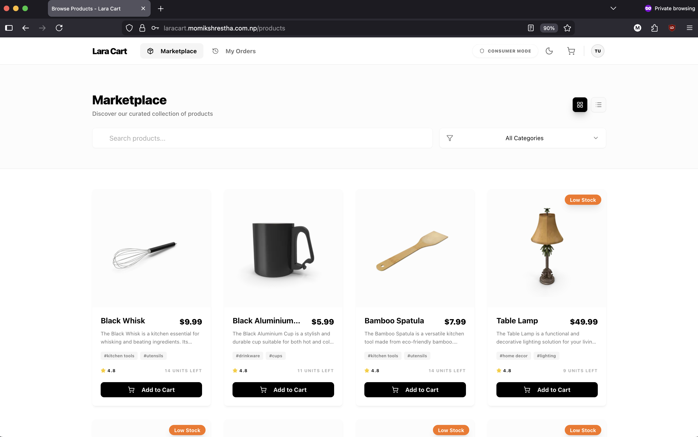 
  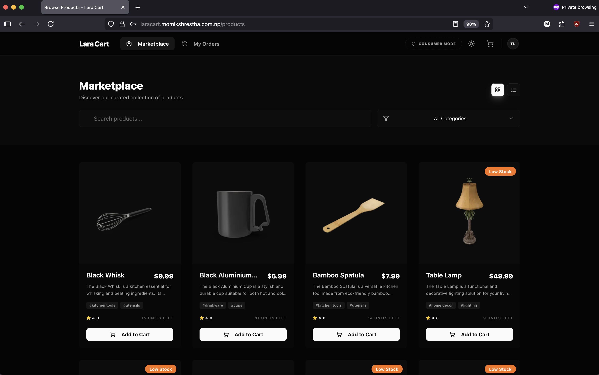
</p>

### Prodcuts List View
<p float="left">
  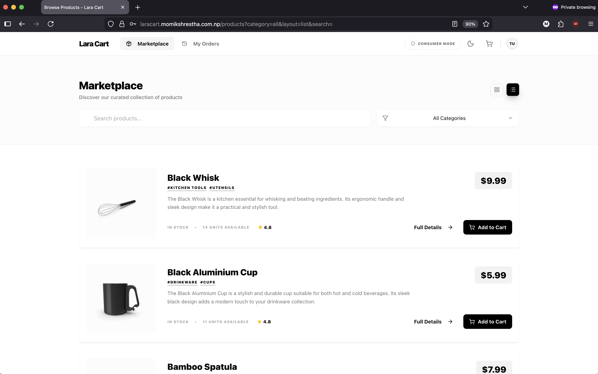
  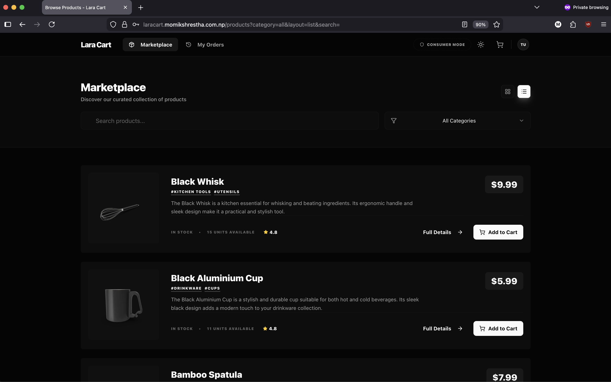
</p>

### Product Details
<p float="left">
  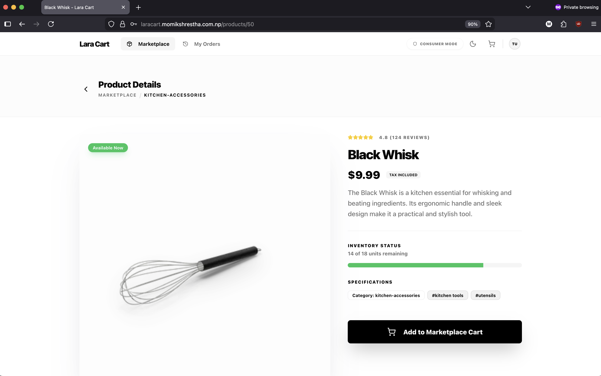
  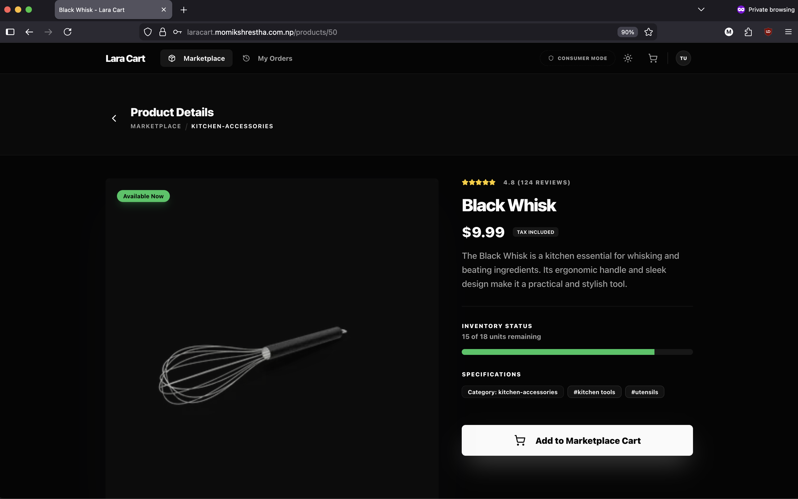
</p>

### Shopping Cart
<p float="left">
  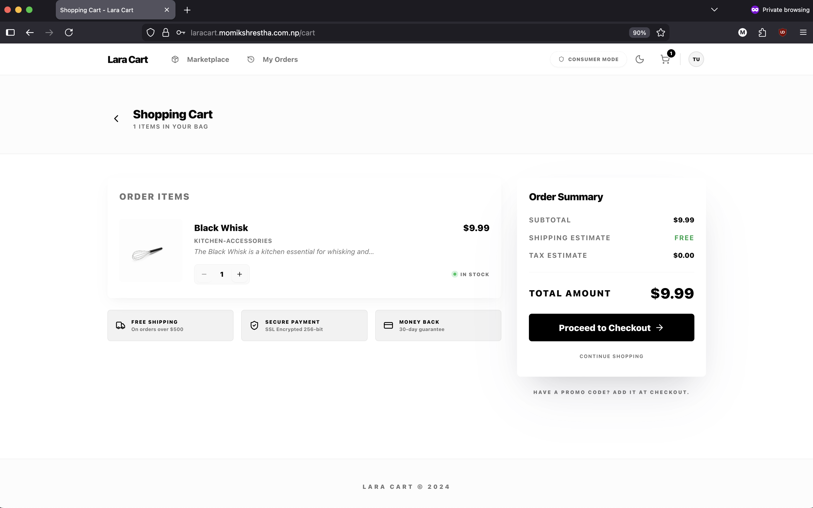
  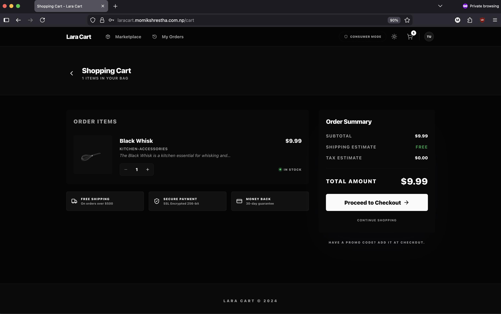
</p>

### Checkout
<p float="left">
  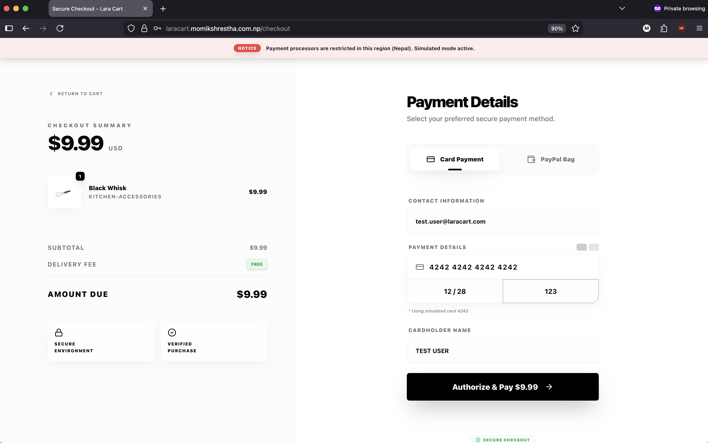
  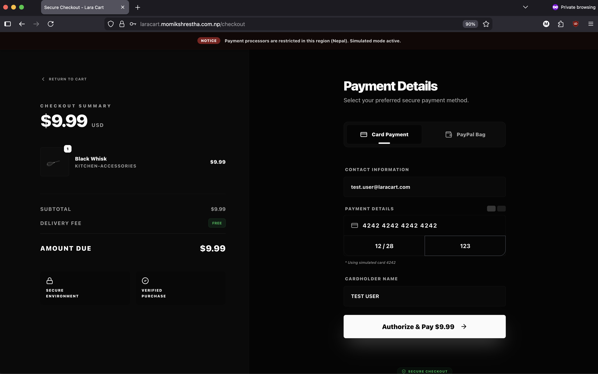
</p>

### Order Management
<p float="left">
  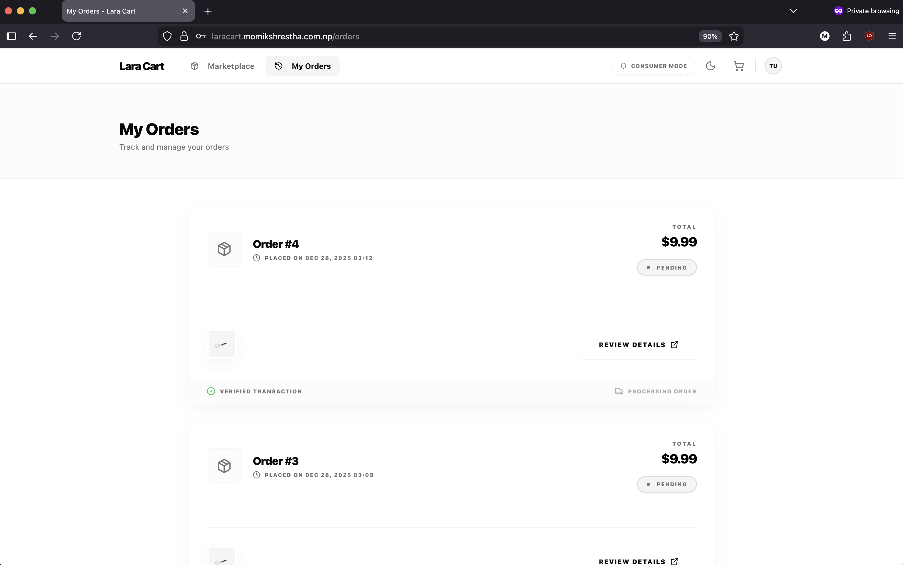
  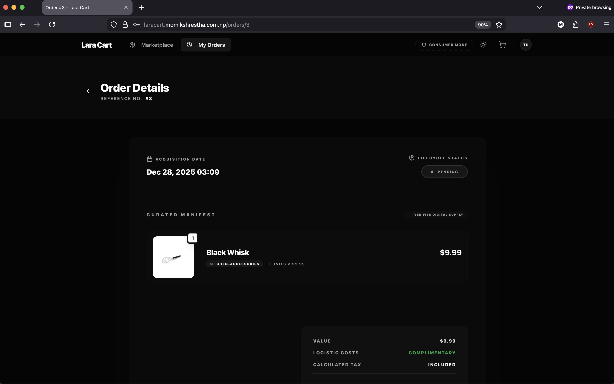
</p>

### Order Details
<p float="left">
  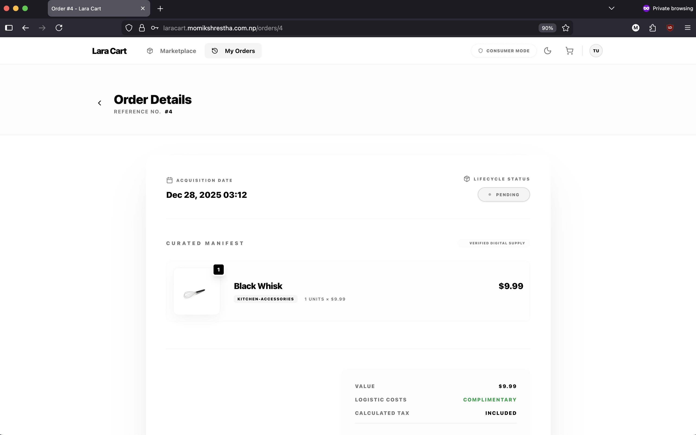
  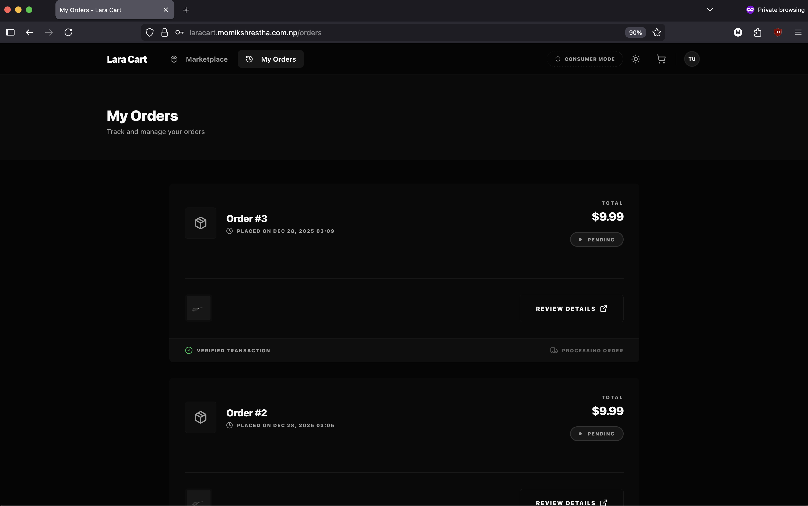
</p>

## Installation and Setup

1.  **Clone the Repository**
    ```bash
    git clone https://github.com/PG-Momik/laracart.git
    cd laracart
    ```

2.  **Install Dependencies**
    ```bash
    composer install
    npm install
    ```

3.  **Environment**
    ```bash
    cp .env.example .env
    php artisan key:generate
    ```

4.  **Database & Seeding**
    ```bash
    touch database/database.sqlite
    php artisan migrate
    php artisan products:fetch --limit=50
    ```

5.  **Run Application**
    ```bash
    php artisan serve
    npm run dev
    php artisan queue:work
    ```
